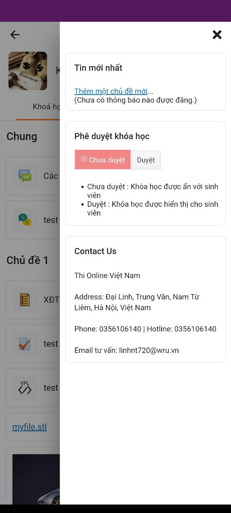
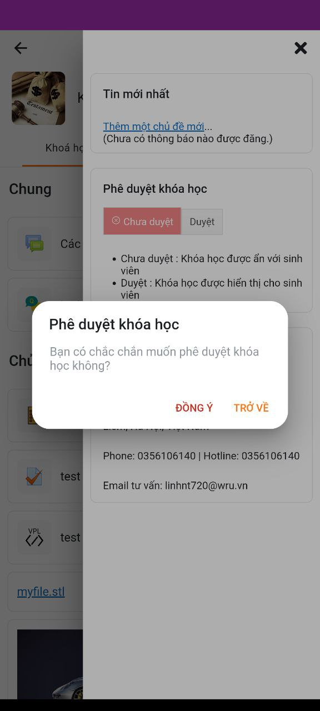
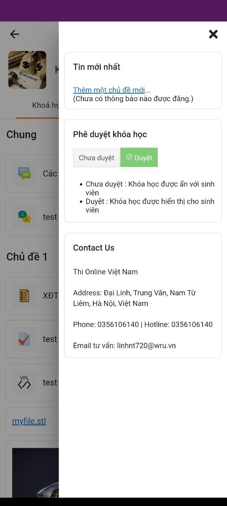
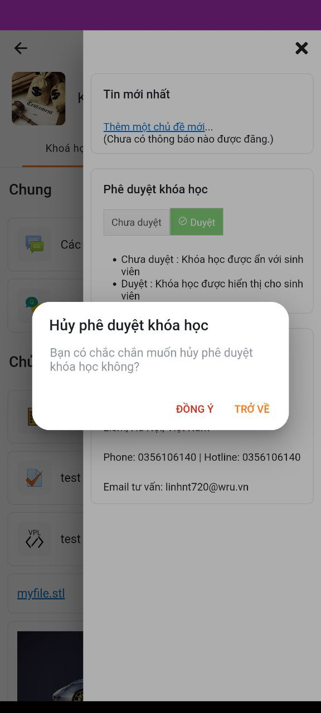

# 1. Hướng dẫn tạo một custom block đơn giản cho Mobile App
## 1.1. Cấu trúc file
```
src/addons/block/pluginname/
 |-- service
 |   -- block-handler.ts
 |-- pluginname.module.ts
```
### 1.2. pluginname.module.ts
- File này sẽ giữ định nghĩa của block và được sử dụng để khai báo nó như một plugin và chứa cách để render giao diện của block.
- Sample code:
  ```ts
    @NgModule({
    providers: [
        {
            provide: APP_INITIALIZER, // Token thực thi trong quá trình khởi tạo app
            multi: true, // cho phép một token giữ nhiều giá trị
            useValue: () => {
                CoreBlockDelegate.registerHandler(AddonBlockPluginnameHandler.instance);
            }, // Function được sử dụng để thực thi
        },
    ],
    })
    export class AddonBlockPluginnameModule {}
  ```
### 1.3. block-handler.ts
- File này sẽ cung cấp thông tin về block sẽ render.
- Sample code:
  ```ts
    /**
    * Block handler.
    */
    @Injectable({ providedIn: 'root' })
    export class AddonBlockPluginnameHandler extends CoreBlockBaseHandler {

        name = 'AddonBlockPluginname';
        blockName = 'pluginname'; // trùng tên block ở web server VD: html

        /**
         * Returns the data needed to render the block.
        *
        * @param block The block to render.
        * @returns Data or promise resolved with the data.
        */
        getDisplayData(block: CoreCourseBlock): CoreBlockHandlerData {

            return {
                title: block.contents?.title || '',
                class: 'addon-block-pluginname',
                component: CoreBlockPreRenderedComponent,
            };
        }

    }

    export const AddonBlockPluginNameHandler = makeSingleton(AddonBlockPluginNameHandlerService);

  ```
### 1.4. Import block vào block.module.ts
- Thêm import đường dẫn cho AddonBlockPluginnameModule
```ts
...
import { AddonBlockPluginnameModule } from './pluginname/pluginname.module';
...
```
- Thêm AddonBlockPluginnameModule vào imports NgModule
```ts
@NgModule({
  imports: [
    ...
    AddonBlockPluginnameModule,
    ...
  ]
})
```
### 1.5. Block Course status
### 1.5.1. Yêu cầu:
- Phê duyệt khóa học trên App cho giảng viên. Khối phê duyệt sẽ không hiển thị đối với học viên.

- Lưu ý: Khối phê duyệt chỉ xuất hiện khi khối phê duyệt đã được thêm vào khóa học trên Web.

### 1.5.2. Mô tả chi tiết/ hướng dẫn sử dụng/ hướng dẫn cài đặt
- TH1: Người dùng đăng nhập tài khoản có quyền phê duyệt khóa học và muốn duyệt khóa học

- B1: Khối phê duyệt sẽ được hiển thị để người dùng phê duyệt trong khóa học:



- B2: Người dùng bấm nút duyệt trong khối phê duyệt thì sẽ có 1 thông báo hiển thị. Bấm nút đồng ý trong thông báo để phê duyệt khóa học:



- B3: Sau khi bấm đồng ý phê duyệt khóa học thành công, nút Duyệt trong khối sẽ chuyển thành màu xanh



- TH2: Người dùng đăng nhập tài khoản có quyền phê duyệt khóa học và muốn hủy duyệt khóa học

- B1: Người dùng bấm nút chưa duyệt trong khối phê duyệt sẽ hiển thị 1 thông báo. Bấm nút đồng ý trong thông báo để hủy phê duyệt:



- Lưu ý: Với 1 số khóa học đã bắt đầu học thì người dùng không thể hủy phê duyệt khóa học:


### 1.5.3. Phân tích thiết kế (database, functions nếu cần)
- Trong hàm ngOnInit trong file src\core\features\block\components\pre-course-status-block\pre-rendered-block.ts ta gọi đến hàm local_th_course_status_check_status() để check trạng thái khóa học đã duyệt hay chưa duyệt trên hệ thống.
```ts
   const site = await CoreSites.getSite();

   const userId = site.getUserId(),
   data: any = {
          userid: userId,
          courseid: this.courseId
   };

   const preSets = {
   getFromCache: false,
   };

   return site.write('local_th_course_status_check_status', data, preSets).then((courses) => {
   const jsonValue = JSON.stringify(courses);
   let temp = JSON.parse(jsonValue)
   this.data = temp
   if(temp.check = true) {
          this.block_status = true
   } else {
          this.block_status = false
   }

   if(temp.status == 0) {
          this.btn_cancel = 'btn_cancel';
          this.btn_confirm = 'un_btn_confirm';
          this.icon_cancel = true;
          this.icon_confirm = false;
   } else if(temp.status == 1)  {
          this.btn_cancel = 'un_btn_cancel';
          this.btn_confirm = 'btn_confirm ';
          this.icon_cancel = false;
          this.icon_confirm = true;
   }
   })
```

- Trong file src\core\features\block\components\pre-course-status-block\pre-rendered-block.ts ta gọi đến hàm local_th_course_status_published_course() để duyệt khóa học.
```ts
   async th_published_course() {
          const site = await CoreSites.getSite();

          const userId = site.getUserId(),
          data: any = {
                 userid: userId,
                 courseid: this.courseId
          };

          const preSets = {
          getFromCache: false,
          };

          this.btn_cancel = 'un_btn_cancel';
          this.btn_confirm = 'btn_confirm ';
          this.icon_cancel = false;
          this.icon_confirm = true;

          return site.write('local_th_course_status_published_course', data, preSets).then((courses) => {
          const jsonValue = JSON.stringify(courses);
          let temp = JSON.parse(jsonValue)
          console.log(temp)
          this.data.status = temp.status
          })


   }
```
- Trong file src\core\features\block\components\pre-course-status-block\pre-rendered-block.ts ta gọi đến hàm local_th_course_status_unpublished_course() để hủy phê duyệt khóa học.
```ts
   async th_un_published_course() {
          const site = await CoreSites.getSite();

          const userId = site.getUserId(),
          data: any = {
                 userid: userId,
                 courseid: this.courseId
          };

          const preSets = {
          getFromCache: false,
          };

          this.btn_cancel = 'btn_cancel';
          this.btn_confirm = 'un_btn_confirm';
          this.icon_cancel = true;
          this.icon_confirm = false;

          return site.write('local_th_course_status_unpublished_course', data, preSets).then((courses) => {
          const jsonValue = JSON.stringify(courses);
          let temp = JSON.parse(jsonValue)
          console.log(temp)
          this.data.status = temp.status
          })
   }
```
### 1.5.4. mã nguồn (nếu cần hướng dẫn viết mã nguồn chi tiết, những thay đổi mã nguồn cần để viết tính năng này)
https://github.com/minhpl/thmoodleapp/compare/ef5348e03b8b9d745fea5292a5345b1ae901be04...bbc2c18bffa1cfac26457e50e46903c5e539b105
